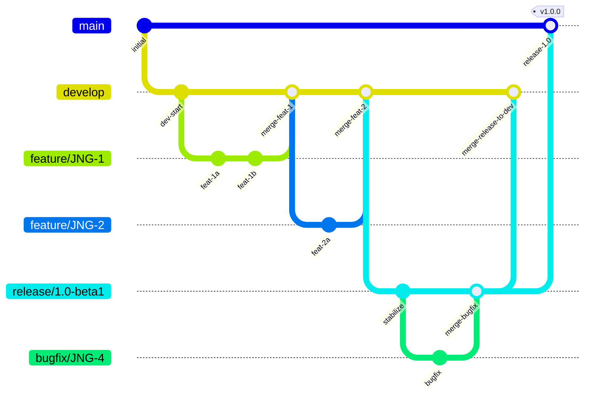
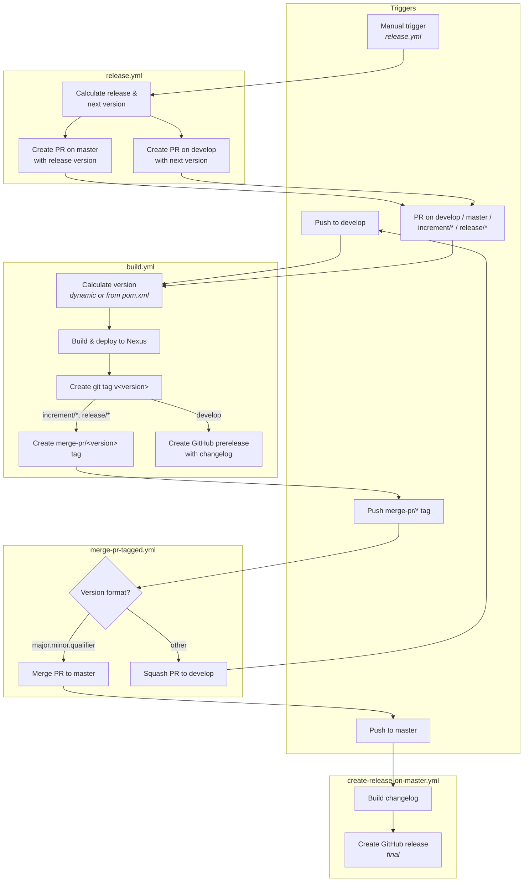

# CI/CD Flow — Development Versioning and Branch Handling

This document describes the GitFlow-based branching strategy, version numbering policies, and GitHub Actions workflows used by this project.

## Branches

The branching model follows [GitFlow](https://www.atlassian.com/git/tutorials/comparing-workflows/gitflow-workflow) with these branch types:

| Branch | Purpose | Lifetime |
|--------|---------|----------|
| `develop` | Main integration branch with latest development sources | Permanent |
| `master` | Latest released sources of the active version | Permanent |
| `feature/JNG-xxx_summary` | New features, branched from `develop` | Temporary |
| `release/x.y-betaN` | Stabilization before a release, branched from `develop` | Temporary |
| `bugfix/JNG-xxx_summary` | Fixes applied to release branches during testing | Temporary |
| `support/JNG-xxx_summary` | Minor changes to a previous release, branched from release | Temporary |
| `hotfix/JNG-xxx_summary` | Urgent fixes applied to both release and `master` | Temporary |

### Branch Flow

The following diagram shows how branches interact over a typical development cycle. Features merge into `develop`, release branches stabilize the code, and releases merge into `master`.



## Version Numbers

Version numbers follow semantic versioning with these rules:

| Event | Version Change | Example |
|-------|---------------|---------|
| Start a feature branch | No change | stays `1.1.0-SNAPSHOT` |
| Start a release branch | Increment 2nd number on `develop` | `develop` goes from `1.1.0` to `1.2.0` |
| Bugfix on release branch | No change | stays at release version |
| Start a support branch | Increment 3rd number | `1.0.0` becomes `1.0.1` |
| Start a hotfix branch | Increment 4th number | `1.0.0` becomes `1.0.0.1` |

### Development vs. Release Versions

On `develop` and `increment/*` branches, CI produces dynamic snapshot versions:
```
major.minor.qualifier.YYYYMMDD_HHMMSS_commitId_branchName
```

On `master` and `release/*` branches, versions are taken directly from `pom.xml` (without `-SNAPSHOT`).

## GitHub Actions Workflows

The project uses 13 GitHub Actions workflows. The four core workflows form a connected pipeline:

### Core Pipeline



### Workflow Details

#### build.yml — Main Build Pipeline

- **Triggers:** Push to `develop`, PRs on `develop`/`master`/`increment/*`/`release/*`
- **Runner:** `judong` (custom), 30-minute timeout
- **JDK:** Zulu 21
- **Steps:**
  1. Calculate version (dynamic for develop, from pom.xml for releases)
  2. Build with `mvn deploy -Psign-artifacts -Prelease-judong`
  3. Create git tag `v<version>`
  4. For `increment/*`/`release/*`: create `merge-pr/<version>` tag (triggers merge workflow)
  5. For `develop`: build changelog and create GitHub prerelease

#### release.yml — Manual Release Trigger

- **Trigger:** Manual dispatch with optional version input (`auto` uses pom.xml version)
- **Steps:**
  1. Determine release version and calculate next version (qualifier + 1)
  2. Create PR targeting `master` with release version
  3. Create PR targeting `develop` with next version
  4. Both PRs trigger `build.yml`

#### merge-pr-tagged.yml — Automated PR Merge

- **Trigger:** Push of `merge-pr/*` tags
- **Steps:**
  1. Extract version from tag name
  2. If version is `major.minor.qualifier` format: merge PR to `master` (triggers release on master)
  3. Otherwise: squash PR to `develop` (triggers build)
  4. Delete the `merge-pr/*` tag

#### create-release-on-master.yml — Final Release

- **Trigger:** Push to `master`
- **Steps:**
  1. Build changelog from commit history
  2. Create final GitHub release (non-prerelease)

### Supporting Workflows

| Workflow | Purpose |
|----------|---------|
| `bump-version.yml` | Manually increment version in pom.xml, creates a PR |
| `delete-old-draft-releases.yml` | Cleans up old draft GitHub releases |
| `build-dependabot.yml` | Skips builds for Dependabot PRs |
| `jira-description-to-pr.yml` | Copies JIRA ticket description into PR body |
| `sync-labels.yml` | Syncs GitHub labels from `.github/labels.yml` |

## Development Rules

> **Important:** There is no commit without a ticket number. Every commit and PR must include a `JNG-xxx` JIRA reference.

Issue tracking is managed in [JIRA](https://blackbelt.atlassian.net/jira/dashboards).
