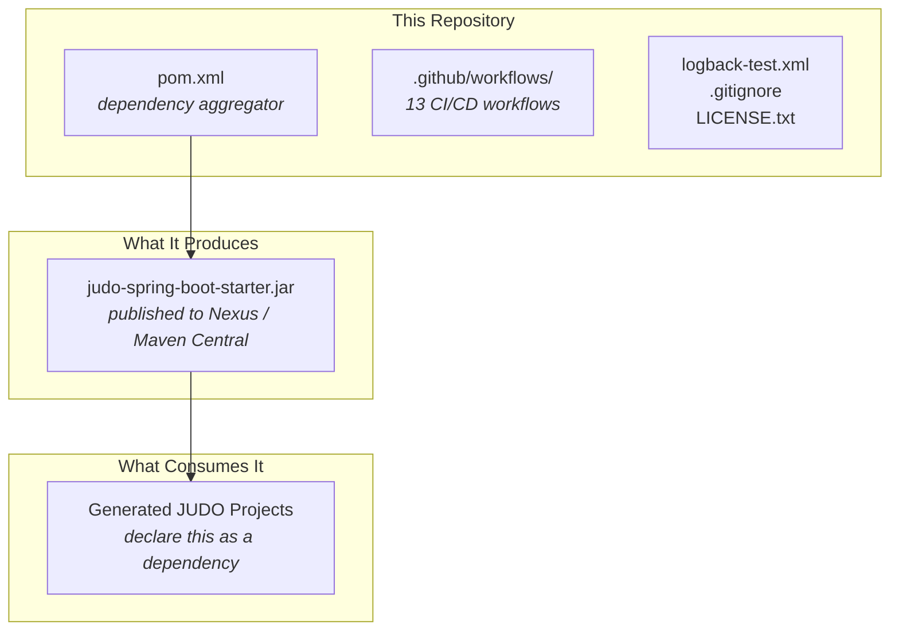

# Contributing to JUDO JSL Spring Boot Starter

This guide covers how to set up your development environment, submit issues, and contribute pull requests to this project.

## Development Environment Setup

Your environment must comply with the requirements in the parent project's [JUDO Community Contributing Guide](https://github.com/BlackBeltTechnology/judo-community/blob/develop/CONTRIBUTING.adoc). At minimum you need:

- **Java 21** JDK (Zulu distribution recommended)
- **Maven 3.8.6+** (or use the included `./mvnw` wrapper)

## Project Structure

This project is a **starter/parent POM only** — it contains no application source code. All the logic lives in the dependencies it aggregates. See `pom.xml` for the complete dependency list.



## Submitting an Issue

Before opening a new issue, search the [issue tracker](https://github.com/BlackBeltTechnology/judo-jsl-springboot-starter/issues) — your problem may already be reported or resolved.

When reporting a bug, include:

| Information | Why It Matters |
|-------------|----------------|
| Output of `java -version` and `mvn -version` | Confirms JDK/Maven compatibility |
| `pom.xml` or `.flattened-pom.xml` | Shows resolved dependency versions |
| A minimal reproduction case | Lets maintainers confirm the bug quickly |

> **Important:** A minimal reproduction is required. Without one, maintainers cannot efficiently isolate and fix the problem.

File new issues using the [issue form](https://github.com/BlackBeltTechnology/judo-jsl-springboot-starter/issues/new/choose).

## Submitting a Pull Request

This project uses [GitHub's standard forking model](https://guides.github.com/activities/forking/). Fork the repository and submit PRs from your fork.

### Commit Convention

Every commit must reference a JIRA ticket number:

```
JNG-1234 Add PostgreSQL connection pool configuration
```

> **Important:** There is no commit without a ticket number. Use the `JNG-xxx` prefix in all commits and PR titles.

### Branch Naming

| Branch Type | Pattern | Base Branch |
|-------------|---------|-------------|
| Feature | `feature/JNG-xxx_short_summary` | `develop` |
| Bugfix | `bugfix/JNG-xxx_short_summary` | release branch |
| Support | `support/JNG-xxx_short_summary` | release branch |
| Hotfix | `hotfix/JNG-xxx_short_summary` | `master` |

See [CI/CD Flow](CIFLOW.md) for the full branching strategy.

## Build Commands

```sh
# Run tests
mvn clean test

# Full build
mvn clean install
```
