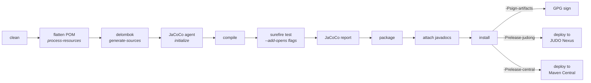

# judo-jsl-springboot-starter

**Repository:** [BlackBeltTechnology/judo-jsl-springboot-starter](https://github.com/BlackBeltTechnology/judo-jsl-springboot-starter)
**License:** Eclipse Public License 2.0 (EPL-2.0)
**Java Version:** 21
**Spring Boot:** 3.5.0

## What This Project Does

This is a **Spring Boot starter** for JSL-based (JUDO Specification Language) applications. It is not a library with its own source code — it is a dependency aggregator that bundles the complete JUDO runtime stack into a single Maven artifact. Generated JUDO projects declare this starter as a dependency to pull in everything they need: the runtime core, DAO layers, dispatcher, access manager, PSM code generators, and database support for HSQLDB and PostgreSQL.

## Dependency Architecture

The starter aggregates three major dependency groups. Understanding how they relate helps when diagnosing version conflicts or adding new capabilities to generated projects.

```mermaid
graph TD
    subgraph "Spring Boot Starter"
        STARTER["judo-spring-boot-starter<br/><i>this project</i>"]
    end

    subgraph "Spring Boot 3.5.0"
        SB_STARTER[spring-boot-starter]
        SB_JDBC[spring-boot-starter-data-jdbc]
    end

    subgraph "JUDO Runtime Core"
        CORE[judo-runtime-core]
        SPRING[judo-runtime-core-spring]
        DISPATCHER[judo-runtime-core-dispatcher]
        ACCESS_API[accessmanager-api]
        ACCESS[accessmanager]
        DAO_CORE[dao-core]
        DAO_RDBMS[dao-rdbms]
        DAO_HSQLDB[dao-rdbms-hsqldb]
        DAO_PG[dao-rdbms-postgresql]
        SPRING_HSQLDB[spring-hsqldb]
        SPRING_PG[spring-postgresql]
    end

    subgraph "JUDO PSM Generator SDK"
        GEN_COMMON[sdk-core-common]
        GEN_API[sdk-core-api]
        GEN_IMPL[sdk-core-impl]
        GEN_SPRING[sdk-core-spring]
    end

    subgraph "Supporting Libraries"
        DAO_API[judo-dao-api]
        SDK_COMMON[judo-sdk-common]
        MAPPER_API[mapper-api]
        MAPPER_IMPL[mapper-impl]
        TATAMI[judo-tatami-asm2rdbms]
        LIQUIBASE[judo-meta-liquibase.model]
        ANTLR[antlr-runtime 3.2]
        LOGBACK[logback-classic 1.5.12]
    end

    STARTER --> SB_STARTER
    STARTER --> SB_JDBC
    STARTER --> CORE
    STARTER --> SPRING
    STARTER --> DISPATCHER
    STARTER --> ACCESS_API
    STARTER --> ACCESS
    STARTER --> DAO_CORE
    STARTER --> DAO_RDBMS
    STARTER --> DAO_HSQLDB
    STARTER --> DAO_PG
    STARTER --> SPRING_HSQLDB
    STARTER --> SPRING_PG
    STARTER --> GEN_COMMON
    STARTER --> GEN_API
    STARTER --> GEN_IMPL
    STARTER --> GEN_SPRING
    STARTER --> DAO_API
    STARTER --> SDK_COMMON
    STARTER --> MAPPER_API
    STARTER --> MAPPER_IMPL
    STARTER --> TATAMI
    STARTER --> LIQUIBASE
    STARTER --> ANTLR
    STARTER --> LOGBACK
```



## Build Lifecycle



## Build Commands

```sh
# Full build
mvn clean install

# Run tests only
mvn clean test

# Build with signing and deploy to JUDO Nexus (CI default)
mvn clean deploy -Psign-artifacts -Prelease-judong

# Deploy to Maven Central
mvn clean deploy -Psign-artifacts -Prelease-central
```

A Maven wrapper is included (`./mvnw`). The build requires **Java 21** (Zulu distribution is used in CI).

## Maven Profiles

| Profile | Purpose |
|---------|---------|
| `sign-artifacts` | GPG-sign all artifacts using `sign-maven-plugin` |
| `release-judong` | Deploy snapshots and releases to BlackBelt JUDO Nexus |
| `release-central` | Deploy to Maven Central via Sonatype OSSRH |
| `release-dummy` | Deploy to a local `file:///tmp/` directory for testing |
| `generate-github-asciidoc-diagrams` | Generate PNG diagrams from PlantUML in `.github/` |
| `update-source-code-license` | Update EPL-2.0 file headers across source files |

## Versioning

The project uses Maven's `${revision}` property for versioning, flattened at build time by `flatten-maven-plugin`. The current development version is `1.0.4-SNAPSHOT`.

On the `develop` branch, CI produces dynamic versions in the format:
```
major.minor.qualifier.YYYYMMDD_HHMMSS_commitId_branchName
```

Release versions follow standard semantic versioning: `major.minor.qualifier`.

## Related Documentation

- [Contributing Guide](CONTRIBUTING.md) — development setup, submission guidelines
- [CI/CD Flow](CIFLOW.md) — branching strategy, version numbering, GitHub Actions workflows
